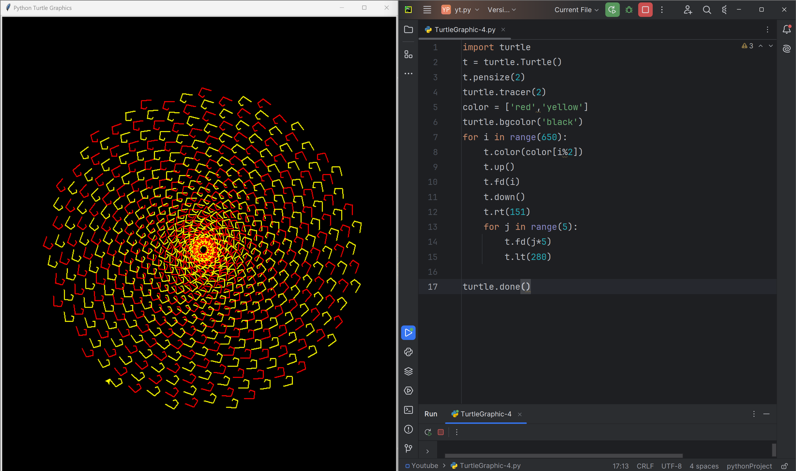

# Rainbow-Spiral

This code uses the Python Turtle library to create a beautiful, intricate spiral pattern with alternating red and yellow colors. The spiral shape is formed by moving the turtle forward and turning it right by 151 degrees in each iteration. The color of the turtle changes between red and yellow for every iteration, creating a striking rainbow effect.

# Tutorial is available on youtube channel 
click on the link to see :- ([Open in Youtube](RainbowSpiral))

# Screenshot

Rainbow-Spiral

# Features
Alternating colors: The spiral pattern features alternating red and yellow colors, creating a rainbow effect.
Intricate design: The spiral shape is formed by moving the turtle forward and turning it right by 151 degrees in each iteration, resulting in a intricate and complex pattern.
Dynamic movement: The turtle moves forward and turns right in each iteration, creating a sense of dynamic movement and energy.

# Run
To run this code, save it to a file with a .py extension (e.g., rainbow_spiral.py) and execute it using Python (e.g., python rainbow_spiral.py). This will launch a window displaying the Rainbow Spiral pattern.

# License
This code is licensed under the MIT License. Feel free to modify, distribute, and use it for any purpose.

# snake.coding
We create a project each 4 days with voting on our <a href="https://youtube.com/@snakecoding_12" target="_blank">Youtube</a> channel.
You can vote for upcoming projects on our channel **community** page :wink:

